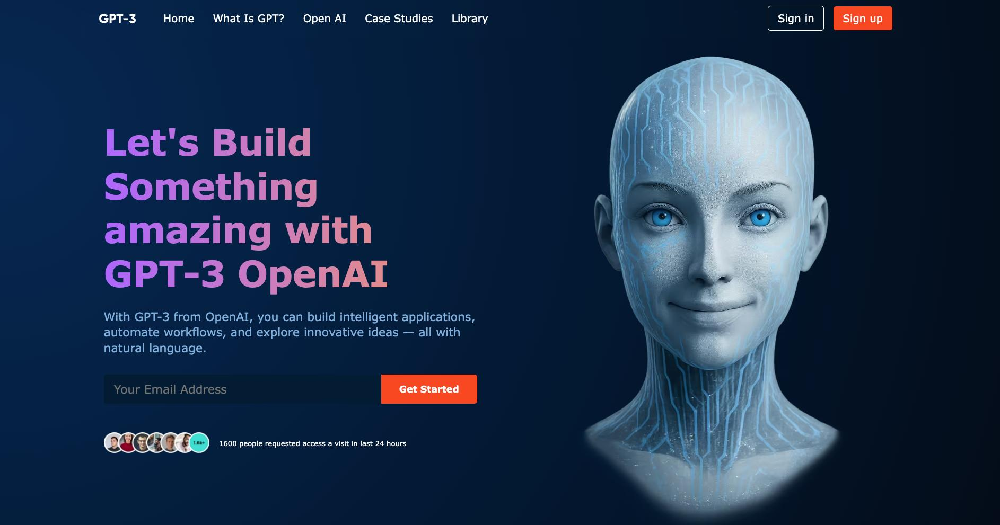

# 🤖 GPT-3 Landing Page


Una landing page moderna inspirada en **GPT-3** y las plataformas de inteligencia artificial, diseñada para presentar información de forma clara y atractiva. El proyecto se centra en un diseño de interfaz limpio, secciones de contenido estructuradas y un layout visual consistente que destaca conceptos clave relacionados con la tecnología de IA.

Construida siguiendo prácticas modernas de desarrollo frontend, la página enfatiza el diseño responsive, la jerarquía visual y una interfaz intuitiva en diferentes tamaños de pantalla.

---

## 🌐 Demo en Vivo

👉 **https://alejandro-gr01.github.io/gpt3-landing/**

---

## 📸 Vista Previa



---

## 🚀 Características

| Característica | Descripción |
|----------------|-------------|
| 🎬 Animaciones GSAP | Transiciones y efectos visuales fluidos con GSAP 3 |
| ⚡ Alto Rendimiento | Build optimizado con Vite 7 |
| 🧩 Componentes React | Arquitectura modular y reutilizable |
| 📱 Diseño Responsivo | Adaptado a móviles, tablets y escritorio |
| 🎨 UI Moderna | Diseño limpio inspirado en productos de IA |
| 🔧 ESLint | Código limpio y libre de errores |

---

## 🛠️ Stack Tecnológico

- **React 19** - Biblioteca UI moderna
- **Vite 7** - Herramienta de build ultrarrápida
- **GSAP 3** - Animaciones profesionales
- **@gsap/react** - Integración de GSAP con React
- **CSS3** - Estilos modernos
- **React Icons** - Iconos vectoriales
- **ESLint** - Linting de código
- **GitHub Pages** - Despliegue automático

---

## 📦 Instalación

```bash
# Clonar el repositorio
git clone https://github.com/Alejandro-GR01/gpt3-landing.git

# Entrar al directorio
cd gpt3-landing

# Instalar dependencias
npm install

# Iniciar servidor de desarrollo
npm run dev

# Build para producción
npm run build

# Previsualizar build de producción
npm run preview

# Verificar código con ESLint
npm run lint

# Desplegar en GitHub Pages
npm run deploy
```

---

## 📂 Estructura del Proyecto

```
gpt3-landing/
├── public/
│   └── gpt3_preview.jpg
├── src/
│   ├── assets/              # Imágenes y recursos estáticos
│   ├── components/           # Componentes reutilizables
│   │   ├── article/
│   │   ├── brand/
│   │   ├── cta/
│   │   ├── feature/
│   │   └── navbar/
│   ├── containers/           # Secciones principales
│   │   ├── blog/
│   │   ├── features/
│   │   ├── footer/
│   │   ├── header/
│   │   ├── possibility/
│   │   └── whatGPT3/
│   ├── constants/           # Constantes y datos
│   ├── App.jsx              # Componente principal
│   ├── App.css
│   ├── index.css            # Estilos globales
│   └── main.jsx             # Punto de entrada
├── index.html
├── package.json
├── vite.config.js
├── eslint.config.js
└── README.md
```

---

## 🎨 Secciones del Landing

1. **Navbar** - Navegación fija con menú responsivo
2. **Header** - Hero section con título y descripción
3. **Brand** - Logos de empresas colaboradoras
4. **WhatGPT3** - Explicación de qué es GPT-3
5. **Features** - Características principales
6. **Possibility** - Posibilidades de la IA
7. **CTA** - Llamada a la acción
8. **Blog** - Artículos relacionados
9. **Footer** - Pie de página con enlaces

---

## 📱 Diseño Responsivo

- 📱 Móvil: 320px+
- 📲 Tablet: 768px+
- 💻 Escritorio: 1024px+
- 🖥 Pantallas grandes: 1440px+

---

## 🧪 Scripts Disponibles

| Comando | Descripción |
|---------|-------------|
| `npm run dev` | Inicia el servidor de desarrollo |
| `npm run build` | Crea el build de producción |
| `npm run preview` | Previsualiza el build de producción |
| `npm run lint` | Verifica el código con ESLint |
| `npm run deploy` | Despliega en GitHub Pages |

---

## 📝 Licencia

MIT

---

🌟 Si te gustó el proyecto, ¡dale una estrella!
